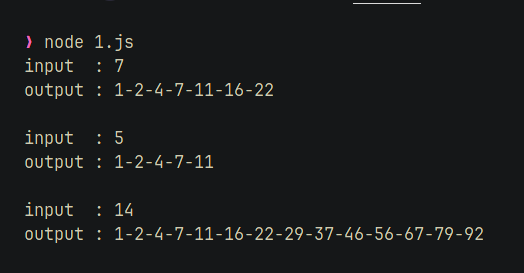
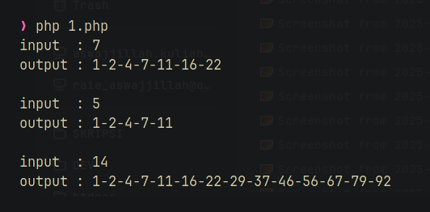
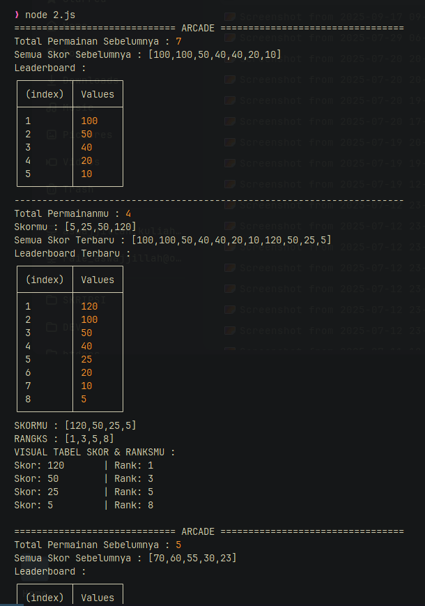
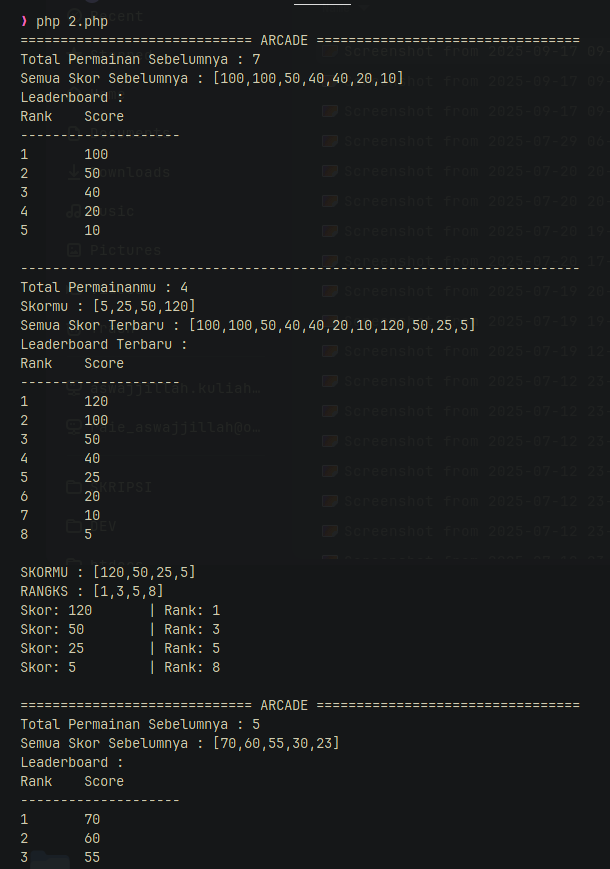
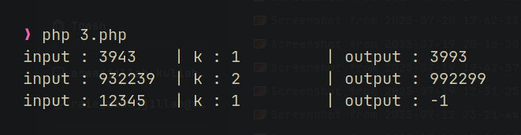

Pastikan NodeJS dan PHP Terinstall di localmu.
How to Check: `node -v` & `php -v`

##

CATATAN : terdapat 2 bahasa yang saya gunakan yaitu JS dan PHP, semua output di keluarkan pada terminal, terdapat juga output hasil berbentuk file gambar dari setiap file code. untuk merubah input bisa melakukan perubahan value setiap input langsung di dalam file code.

## 1. A000124 of Sloane’s OEIS.
run JS code :
```bash
node 1.js
```


run PHP code :
```bash
php 1.php
```


## 2. Dense Ranking
run JS code :
```bash
node 2.js
```

run PHP code :
```bash
php 2.php
```


## 3. Highest Palindrome
run JS code :
```bash
node 3.js
```

run PHP code :
```bash
php 3.php
```


##